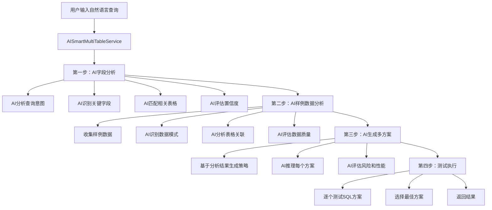

# 🤖 AI驱动的多表联查逻辑架构

## 📋 概述

基于用户需求，我们重新设计了多表联查功能，采用**全AI驱动**的三步流程：
1. **AI字段分析** - 替代传统的字段分析
2. **AI样例数据分析** - 替代简单的数据收集
3. **AI生成多方案** - 基于前两步的AI分析结果

## 🏗️ 架构设计



## 🔧 核心实现

### **1. 服务架构**

```typescript
// 主服务类
export class AISmartMultiTableService {
  private apiKey: string;
  private endpoint: string;
  private model?: string;
  
  // 主入口方法
  async generateSmartMultiTableSQL(
    text: string,
    tableInfo: TableInfo[],
    getSampleData: Function,
    executeSQL: Function,
    onProgress?: Function
  ): Promise<SQLGenerationResult>
}

// 集成到AIService中
export class AIService {
  private smartMultiTableService: AISmartMultiTableService;
  
  async generateMultiTableSQL(...args) {
    return await this.smartMultiTableService.generateSmartMultiTableSQL(...args);
  }
}
```

### **2. 四步工作流程**

#### **第一步：AI字段分析**

```typescript
private async aiFieldAnalysis(
  text: string,
  tableInfo: TableInfo[]
): Promise<{
  relevantTables: TableInfo[];
  keyFields: string[];
  queryIntent: string;
  fieldMappings: Array<{
    queryTerm: string;
    matchedFields: Array<{
      tableId: string;
      tableName: string;
      fieldId: string;
      fieldName: string;
      confidence: number;
    }>;
  }>;
}>
```

**AI分析内容：**
- 🎯 **查询意图识别**：理解用户想要什么
- 🔍 **关键词提取**：识别查询中的关键词汇
- 📊 **表格匹配**：找到最相关的表格
- 🎲 **置信度评估**：评估每个匹配的可信度

**AI提示词结构：**
```
你是一个专业的数据库字段分析专家。请分析用户查询，识别相关的表格和字段。

## 可用表格信息
[表格结构详情]

## 分析任务
1. 识别查询意图和关键词
2. 匹配相关的表格和字段
3. 分析字段间的关联关系
4. 评估每个匹配的置信度

## 输出格式
JSON格式包含：queryIntent, keyFields, relevantTables, fieldMappings
```

#### **第二步：AI样例数据分析**

```typescript
private async aiSampleDataAnalysis(
  text: string,
  relevantTables: TableInfo[],
  getSampleData: Function
): Promise<{
  dataPatterns: Array<{
    tableId: string;
    pattern: string;
    description: string;
    sampleCount: number;
  }>;
  tableRelationships: Array<{
    table1: string;
    table2: string;
    relationshipType: string;
    confidence: number;
    joinFields: Array<{
      field1: string;
      field2: string;
    }>;
  }>;
  dataQuality: {
    completeness: number;
    consistency: number;
    recommendations: string[];
  };
}>
```

**AI分析内容：**
- 📈 **数据模式识别**：理解每个表格的数据特征
- 🔗 **关联关系分析**：发现表格间的连接方式
- 📊 **数据质量评估**：评估数据完整性和一致性
- 💡 **优化建议**：提供查询策略建议

**AI提示词结构：**
```
你是一个专业的数据模式分析专家。请分析样例数据，识别数据模式和表格关联关系。

## 相关表格信息
[表格结构详情]

## 样例数据
[实际样例数据]

## 分析任务
1. 识别每个表格的数据模式
2. 分析表格间的关联关系
3. 评估数据质量
4. 提供优化建议

## 输出格式
JSON格式包含：dataPatterns, tableRelationships, dataQuality
```

#### **第三步：AI生成多方案**

```typescript
private async aiGenerateMultipleStrategies(
  text: string,
  fieldAnalysis: any,
  dataAnalysis: any
): Promise<SQLAlternative[]>
```

**AI分析内容：**
- 🎯 **策略选择**：基于前两步分析选择最佳策略
- 🧠 **推理过程**：详细解释每个方案的选择理由
- ⚖️ **风险评估**：评估每个方案的执行风险
- ⭐ **推荐指数**：给出AI的推荐评分

**AI提示词结构：**
```
你是一个专业的多表联查SQL专家。基于前面的字段分析和数据分析结果，生成最多3个不同的备选SQL方案。

## 字段分析结果
[AI字段分析的详细结果]

## 数据分析结果
[AI数据分析的详细结果]

## 策略选项
1. UNION策略：合并相同结构的表格数据
2. JOIN策略：通过关联字段连接表格
3. 子查询策略：使用子查询处理复杂逻辑
4. 聚合策略：重点使用GROUP BY和聚合函数
5. 筛选策略：重点使用WHERE条件精确筛选

## 输出格式
JSON格式包含：alternatives数组，每个包含sql, description, reasoning, recommendation, strategy
```

#### **第四步：测试执行**

```typescript
// 逐个测试每个备选方案
for (let i = 0; i < alternatives.length; i++) {
  const alternative = alternatives[i];
  try {
    const result = await executeSQL(alternative.sql);
    // 记录成功结果
  } catch (sqlError) {
    // 记录失败结果
  }
}
```

## 🎯 **核心优势**

### **1. 全AI驱动**
- ✅ **智能理解**：AI深度理解查询意图
- ✅ **自动分析**：无需手动配置字段映射
- ✅ **智能推理**：基于数据特征自动推理最佳策略

### **2. 三层分析**
- 🎯 **语义层**：理解用户真正想要什么
- 📊 **数据层**：分析实际数据的特征和质量
- 🔧 **策略层**：选择最适合的查询策略

### **3. 透明化过程**
- 📝 **详细日志**：记录每一步的AI分析过程
- 🔍 **可追溯**：用户可以看到AI的推理逻辑
- 📊 **置信度**：提供每个决策的置信度评分

### **4. 自适应优化**
- 🎯 **动态策略**：根据数据特征动态选择策略
- 📈 **质量评估**：实时评估数据质量并调整策略
- 🔄 **多方案备选**：提供多个备选方案降低失败风险

## 📊 **数据流转**

```
用户查询 
    ↓
AI字段分析 (queryIntent, fieldMappings, relevantTables)
    ↓
AI数据分析 (dataPatterns, tableRelationships, dataQuality)
    ↓
AI策略生成 (alternatives[sql, reasoning, recommendation])
    ↓
测试执行 (bestAlternative, executionResults)
    ↓
返回结果 (success, sql, result, alternatives, history)
```

## 🔧 **配置参数**

```typescript
// AI服务配置
const aiService = new AIService({
  apiKey: "fastgpt-icQ3F3O5tk2sFPekDxH6TV42mGH2DtWq7j4dwDc8VOPcA5zHkUix",
  endpoint: "http://localhost:3001/chat/completions",
  model: "deepseek-v3.1",
  maxRetries: 3,
  sampleSize: 5
});

// AI调用参数
{
  temperature: 0.2,  // 较低的随机性，确保结果稳定
  max_tokens: 2000   // 足够的token支持复杂分析
}
```

## 📈 **性能优化**

### **1. 缓存机制**
- 🗄️ **语义缓存**：缓存相似查询的分析结果
- 📊 **关系缓存**：缓存表格关联关系分析
- 🎯 **策略缓存**：缓存成功的查询策略

### **2. 渐进式分析**
- 🎯 **快速筛选**：先快速筛选相关表格
- 📊 **深度分析**：对相关表格进行深度分析
- 🔧 **策略优化**：基于历史成功率优化策略选择

### **3. 错误恢复**
- 🔄 **自动重试**：AI分析失败时自动重试
- 📋 **降级策略**：AI不可用时回退到传统方法
- 🛡️ **异常处理**：完善的异常处理和错误报告

## 🎮 **使用示例**

### **输入**
```
用户查询: "各个机房的总花费"
```

### **第一步：AI字段分析结果**
```json
{
  "queryIntent": "统计各个机房的总花费，需要按机房分组并计算费用总和",
  "keyFields": ["机房", "花费", "费用", "成本"],
  "relevantTables": [
    {
      "id": "tblgGkIG6KXMreAt",
      "tableName": "机房信息表",
      "relevanceScore": 0.95
    }
  ],
  "fieldMappings": [
    {
      "queryTerm": "机房",
      "matchedFields": [
        {
          "tableId": "tblgGkIG6KXMreAt",
          "fieldId": "fldx0eTrI9",
          "fieldName": "机房",
          "confidence": 0.98
        }
      ]
    }
  ]
}
```

### **第二步：AI数据分析结果**
```json
{
  "dataPatterns": [
    {
      "tableId": "tblgGkIG6KXMreAt",
      "pattern": "机房基础信息表",
      "description": "包含机房名称和基础属性",
      "sampleCount": 5
    }
  ],
  "tableRelationships": [
    {
      "table1": "tblgGkIG6KXMreAt",
      "table2": "tblG4JCkiLmZ9xpT",
      "relationshipType": "一对多",
      "confidence": 0.85,
      "joinFields": [
        {
          "field1": "SourceID",
          "field2": "SourceID"
        }
      ]
    }
  ],
  "dataQuality": {
    "completeness": 0.9,
    "consistency": 0.85,
    "recommendations": ["建议使用LEFT JOIN确保数据完整性"]
  }
}
```

### **第三步：AI生成方案结果**
```json
{
  "alternatives": [
    {
      "sql": "SELECT t1.fldx0eTrI9 AS 机房, SUM(t2.fld418cBjF) AS 总花费 FROM tblgGkIG6KXMreAt t1 LEFT JOIN tblG4JCkiLmZ9xpT t2 ON t1.SourceID = t2.SourceID GROUP BY t1.fldx0eTrI9;",
      "description": "JOIN策略 - 通过SourceID关联机房表和费用表",
      "reasoning": "基于数据分析发现两表通过SourceID关联，使用LEFT JOIN确保所有机房都被包含",
      "recommendation": "⭐⭐⭐⭐⭐ 最推荐 - 数据完整性高，逻辑清晰",
      "strategy": "JOIN策略"
    }
  ]
}
```

## 🎉 **总结**

新的AI驱动多表联查系统通过：

1. **🤖 AI字段分析** → 智能理解查询意图和字段映射
2. **📊 AI数据分析** → 深度分析数据模式和表格关联
3. **🎯 AI策略生成** → 基于分析结果生成最优查询方案
4. **🔧 智能执行** → 自动测试并选择最佳方案

实现了真正的**智能化、自动化、透明化**的多表联查功能！

---

**🚀 现在可以体验全新的AI驱动多表联查功能了！**