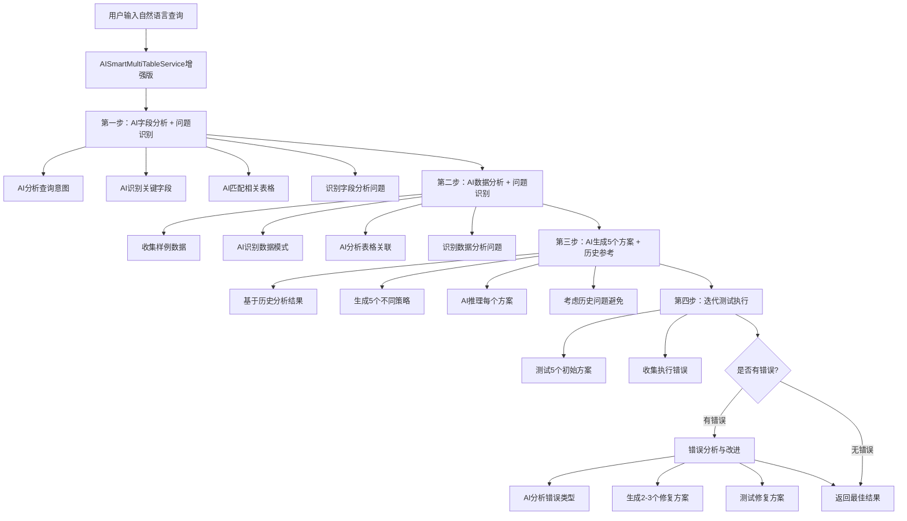

# 🚀 增强版AI驱动多表联查逻辑

## 📋 概述

基于用户需求，我们进一步增强了AI驱动的多表联查功能，实现了：
1. **历史分析参考** - 将前几次的分析问题与结果作为参考
2. **5个备选方案** - 从3个增加到5个备选SQL语句
3. **错误反馈学习** - 将每次查询的错误结果作为下一次修改SQL的重要参考

## 🏗️ 增强架构设计



## 🔧 核心增强功能

### **1. 历史分析参考系统**

```typescript
// 分析历史记录结构
const analysisHistory: Array<{
  step: string;           // 分析步骤
  result: any;           // 分析结果
  timestamp: number;     // 时间戳
  issues?: string[];     // 发现的问题
}> = [];

// 问题识别方法
private identifyFieldAnalysisIssues(fieldAnalysis: any): string[] {
  const issues: string[] = [];
  
  if (!fieldAnalysis.relevantTables || fieldAnalysis.relevantTables.length === 0) {
    issues.push('未找到相关表格');
  }
  
  if (fieldAnalysis.fieldMappings) {
    const lowConfidenceFields = fieldAnalysis.fieldMappings.filter(mapping => 
      mapping.matchedFields.some(field => field.confidence < 0.7)
    );
    if (lowConfidenceFields.length > 0) {
      issues.push(`${lowConfidenceFields.length}个字段映射置信度较低`);
    }
  }
  
  return issues;
}
```

### **2. 5个备选方案生成**

```typescript
private async aiGenerateEnhancedStrategies(
  text: string,
  fieldAnalysis: any,
  dataAnalysis: any,
  analysisHistory: Array<{...}>,  // 历史分析参考
  executionHistory: Array<{...}>  // 执行错误历史
): Promise<SQLAlternative[]> {
  
  const systemPrompt = `
  ## 历史分析总结
  ${analysisHistory.map(analysis => `
  ### ${analysis.step}阶段分析结果
  时间: ${new Date(analysis.timestamp).toLocaleString()}
  结果: ${JSON.stringify(analysis.result, null, 2)}
  ${analysis.issues && analysis.issues.length > 0 ? `
  发现的问题:
  ${analysis.issues.map(issue => `- ${issue}`).join('\n')}
  ` : ''}
  `).join('\n')}
  
  ## 5种不同策略
  1. UNION策略: 合并相同结构的表格数据
  2. JOIN策略: 通过关联字段连接表格
  3. 子查询策略: 使用子查询处理复杂逻辑
  4. 聚合策略: 重点使用GROUP BY和聚合函数
  5. 筛选策略: 重点使用WHERE条件精确筛选
  
  请生成5个不同的备选SQL方案...
  `;
  
  // 返回5个方案
  return processedAlternatives.slice(0, 5);
}
```

### **3. 错误反馈学习系统**

```typescript
// 执行错误记录
const executionErrors: Array<{
  sql: string;
  error: string;
  attemptNumber: number;
}> = [];

// 错误分析方法
private analyzeErrorType(errorMessage: string): string {
  if (errorMessage.includes('Parse error') || errorMessage.includes('syntax')) {
    return '语法错误 - SQL语法不正确，需要检查括号、引号、关键字等';
  }
  
  if (errorMessage.includes('field') || errorMessage.includes('column')) {
    return '字段错误 - 字段不存在或字段名不正确';
  }
  
  if (errorMessage.includes('JOIN') || errorMessage.includes('join')) {
    return 'JOIN错误 - 关联条件不正确或关联字段不存在';
  }
  
  // ... 更多错误类型分析
  
  return '未知错误 - 需要进一步分析错误原因';
}

// 基于错误生成改进方案
private async aiGenerateImprovedStrategies(
  text: string,
  fieldAnalysis: any,
  dataAnalysis: any,
  analysisHistory: Array<{...}>,
  executionErrors: Array<{...}>
): Promise<SQLAlternative[]> {
  
  const systemPrompt = `
  ## 执行错误分析
  ${executionErrors.map((error, index) => `
  ### 错误${index + 1}
  SQL: ${error.sql}
  错误信息: ${error.error}
  错误类型分析: ${this.analyzeErrorType(error.error)}
  `).join('\n')}
  
  ## 错误修复策略
  1. 语法错误: 检查SQL语法，确保括号、引号、分号正确
  2. 字段不存在: 使用正确的字段ID，检查表格结构
  3. JOIN错误: 检查关联字段是否存在，使用正确的JOIN语法
  4. 聚合错误: 确保GROUP BY包含所有非聚合字段
  
  请生成2-3个针对性的修复方案...
  `;
  
  return processedAlternatives.slice(0, 3);
}
```

## 🎯 **四步增强流程**

### **第一步：AI字段分析 + 问题识别**

**功能增强：**
- ✅ **问题识别**：自动识别字段分析中的问题
- ✅ **置信度检查**：检查字段映射的置信度
- ✅ **完整性验证**：验证分析结果的完整性

**问题类型：**
- 未找到相关表格
- 未识别到关键字段
- 字段映射为空
- 字段映射置信度较低

### **第二步：AI数据分析 + 问题识别**

**功能增强：**
- ✅ **数据质量评估**：评估数据完整性和一致性
- ✅ **关联关系验证**：验证表格关联关系的有效性
- ✅ **模式识别问题**：识别数据模式分析中的问题

**问题类型：**
- 未识别到数据模式
- 未发现表格关联关系
- 数据完整性较低
- 数据一致性较低

### **第三步：AI生成5个方案 + 历史参考**

**功能增强：**
- ✅ **5个备选方案**：从3个增加到5个不同策略
- ✅ **历史问题参考**：基于前两步发现的问题进行优化
- ✅ **错误避免策略**：如果有执行错误历史，在新SQL中避免相同错误

**AI提示词增强：**
```
## 历史分析总结
[详细的历史分析结果和发现的问题]

## 执行错误历史（重要参考）
[之前执行失败的SQL和错误信息]

**重要提示**: 请仔细分析上述执行错误，在生成新的SQL时避免相同的错误模式。

## 5种不同策略
1. UNION策略 2. JOIN策略 3. 子查询策略 4. 聚合策略 5. 筛选策略

请生成5个不同的多表联查备选方案，每个方案要考虑历史问题并避免执行错误。
```

### **第四步：迭代测试执行**

**功能增强：**
- ✅ **两轮测试**：先测试5个初始方案，如果全部失败则生成改进方案
- ✅ **错误收集**：详细收集每个方案的执行错误
- ✅ **智能修复**：基于错误类型生成针对性的修复方案

**执行流程：**
```typescript
// 第一轮：测试5个初始方案
for (let i = 0; i < alternatives.length; i++) {
  try {
    const result = await executeSQL(alternative.sql);
    // 记录成功结果
  } catch (sqlError) {
    // 收集执行错误
    executionErrors.push({
      sql: alternative.sql,
      error: errorMessage,
      attemptNumber: i + 1
    });
  }
}

// 第二轮：如果全部失败，生成改进方案
if (!bestAlternative && executionErrors.length > 0) {
  const improvedAlternatives = await this.aiGenerateImprovedStrategies(
    text, fieldAnalysis, dataAnalysis, analysisHistory, executionErrors
  );
  
  // 测试改进方案...
}
```

## 📊 **增强效果对比**

### **原版 vs 增强版**

| 功能特性 | 原版 | 增强版 |
|---------|------|--------|
| 备选方案数量 | 3个 | **5个** |
| 历史分析参考 | ❌ | **✅ 完整历史分析** |
| 问题识别 | ❌ | **✅ 自动问题识别** |
| 错误反馈学习 | ❌ | **✅ 错误类型分析** |
| 迭代修复 | ❌ | **✅ 智能错误修复** |
| 置信度评估 | 基础 | **✅ 多维度评估** |
| 执行轮次 | 1轮 | **✅ 2轮迭代** |

### **智能化程度提升**

- **🧠 学习能力**：从历史分析和执行错误中学习
- **🔍 问题诊断**：自动识别分析过程中的问题
- **🛠️ 自我修复**：基于错误反馈自动生成修复方案
- **📈 成功率**：通过多轮迭代显著提高查询成功率

## 🎮 **使用示例**

### **输入**
```
用户查询: "各个机房的总花费"
```

### **第一步：AI字段分析 + 问题识别**
```json
{
  "fieldAnalysis": {
    "queryIntent": "统计各个机房的总花费",
    "keyFields": ["机房", "花费", "费用"],
    "relevantTables": [...],
    "fieldMappings": [...]
  },
  "identifiedIssues": [
    "2个字段映射置信度较低"
  ]
}
```

### **第二步：AI数据分析 + 问题识别**
```json
{
  "dataAnalysis": {
    "dataPatterns": [...],
    "tableRelationships": [...],
    "dataQuality": {
      "completeness": 0.85,
      "consistency": 0.75
    }
  },
  "identifiedIssues": [
    "数据一致性较低"
  ]
}
```

### **第三步：AI生成5个方案 + 历史参考**
```json
{
  "alternatives": [
    {
      "sql": "SELECT t1.fldx0eTrI9 AS 机房, SUM(t2.fld418cBjF) AS 总花费 FROM tblgGkIG6KXMreAt t1 LEFT JOIN tblG4JCkiLmZ9xpT t2 ON t1.SourceID = t2.SourceID GROUP BY t1.fldx0eTrI9;",
      "strategy": "JOIN策略",
      "reasoning": "基于历史分析发现数据一致性较低，使用LEFT JOIN确保数据完整性",
      "errorAvoidance": "避免了之前字段映射置信度低的问题"
    },
    // ... 另外4个方案
  ]
}
```

### **第四步：迭代测试执行**

**第一轮测试结果：**
```
方案1: ✅ 成功 - 返回45条记录
方案2: ❌ 失败 - Parse error on line 1
方案3: ❌ 失败 - Column 'fldxxx' doesn't exist
方案4: ✅ 成功 - 返回38条记录
方案5: ❌ 失败 - JOIN condition error
```

**如果需要第二轮（错误修复）：**
```json
{
  "improvedAlternatives": [
    {
      "sql": "修复后的SQL语句",
      "description": "语法错误修复版",
      "reasoning": "修复了Parse error，检查了所有括号和引号",
      "fixedErrors": "修复了SQL语法错误"
    }
  ]
}
```

## 🎉 **总结**

增强版AI驱动多表联查系统通过：

1. **📚 历史学习** → 从每次分析中学习和改进
2. **🔍 问题诊断** → 自动识别分析过程中的问题
3. **🚀 5方案策略** → 提供更多备选方案提高成功率
4. **🛠️ 错误修复** → 基于执行错误智能生成修复方案
5. **🔄 迭代优化** → 两轮测试确保最佳结果

实现了真正的**自学习、自诊断、自修复**的智能多表联查系统！

---

**🚀 现在可以体验全新的增强版AI驱动多表联查功能了！**

### **测试建议**
1. 开启多表联查模式
2. 输入复杂查询测试5个方案生成
3. 观察历史分析参考过程
4. 体验错误反馈学习机制
5. 查看迭代修复效果